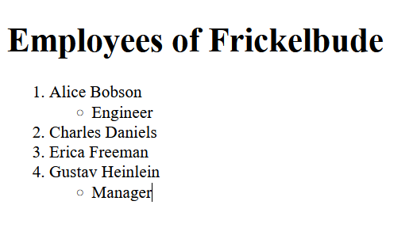

# JavaScript Templates Demo

## Setup

Zuerst wird das NPM-Package initialisiert:

    npm init

Hierzu werden folgende Angaben gemacht bzw. die Vorschläge übernommen:

    package name: javascript-templates-demo
    version: 0.0.1
    description: Demonstration of Mustache templates with Node.js
    entry point: index.js
    test command: [leer]
    git repository: git@code.frickelbude.ch:ipt6/javascript-templates-demo.git
    keywords: JavaScript, Templates, Mustache
    author: Patrick Bucher
    license: MIT
    Is this OK? yes

Hierdurch wird die Datei `package.json` erzeugt, welche ins Repository aufgenommen wird:

    git add package.json
    git commit -m 'initialized package'

## Engine 1: Mustache

### Mustache-Package installieren

Weiter wird die [Mustache](https://github.com/janl/mustache.js#include-templates)-Library installiert:

    npm install mustache --save

Hierdurch entsteht die Datei `package-lock.json`, welche die verwendete
Versionsangabe enthält. Diese Datei sollte ins Repository aufgenommen werden.
Auch die Datei `package.json` hat sich geändert:

    git add package-lock.json package.json
    git commit -m 'installed mustache library'

Der Ordner `node_modules` hingegen, der die heruntergeladenen Artefakte der
Mustache-Library enthält, gehört _nicht_ ins Git-Repository. Schliesslich haben
wir alle Angaben in den Dateien `package.json` und `package-lock.json`
festgehalten, um den Inhalt von `node_modules` wiederherzustellen. Darum
erstellen wir eine Datei namens `.gitignore` mit folgendem Inhalt:

    node_modules/

Auch diese Datei wird ins Repository aufgenommen:

    git add .gitignore
    git commit -m 'ignore node_modules folder'

### Template erstellen

Nun erstellen wir das erste Mustache-Template im Unterverzeichnis `templates/`.
Wir nennen die Datei `hello-world.html`, und sie hat folgenden Inhalt:

```html
<!DOCTYPE html>
<html lang="de">
    <head>
        <meta charset="utf-8">
        <title>Hello, World!</title>
    </head>
    <body>
        <h1>Hello, {{ what }}!</h1>
    </body>
</html>
```

Hierbei handelt es sich um ein einfaches HTML-Grundgerüst. Das einzig Spezielle
ist der `<h1>`-Element, welches folgenden Inhalt hat:

    Hello, {{ what }}!

Der Teil mit den doppelten geschweiften Klammern ist das _Template_. Hier soll
nicht etwa das Wort `what` dargestellt werden, sondern der Inhalt einer
Variablen namens `what`.

Das Template wird in das Git-Repository aufgenommen:

    git add templates
    git commi -m 'added first template'

### Template rendern

Nun wird der JavaScript-Code geschrieben, der das Template verwendet. Hierzu
erstellen wir die Datei `hello-world.js` im Unterverzeichnis `src/` mit
folgendem Inhalt:

```javascript
const fs = require('fs');
const Mustache = require('mustache');

fs.readFile('templates/hello-world.html', 'utf-8', (_, template) => {
    const data = {
        what: 'World'
    };
    const output = Mustache.render(template, data);
    console.log(output);
});
```

Hier wird mithilfe des `fs` (für "File Sytem") die Template-Datei eingelesen.
Das `data`-Objekt enthält die Informationen, welche Platzhalter (`what`) durch
welchen Wert (`'World'`) ersetzt werden sollen. Mithilfe von `Mustache.render()`
wird das Template gerendert.

Nun können wir den Code testen:

    node src/hello-world.js

Dabei sollte folgender HTML-Code ausgegeben werden:

```html
<!DOCTYPE html>
<html lang="de">
    <head>
        <meta charset="utf-8">
        <title>Hello, World!</title>
    </head>
    <body>
        <h1>Hello, World!</h1>
    </body>
</html>
```

Anstelle des Templates `{{ what }}` erscheint nun das Wort `World`: Das Template
wurde wie erwünscht gerendert!

Selbstversändlich wird der Code ins Git-Repository aufgenommen:

    git add src/hello-world.js
    git commit -m 'first template rendering code'

## Engine 2: Nunjucks

Mustache-Templates erlauben keine Logik wie z.B. `if`/`else`-Verzweigungen oder
`for`-Loops. Hierzu gibt es andere Libraries wie z.B.
[Nunjucks](https://mozilla.github.io/nunjucks/).

Diese soll in einem erweiterten Beispiel ausprobiert werden.

Zunächst installieren wir die Nunjucks-Library:

    npm install nunjucks --save

Da wir den Code im zweiten Beispiel nicht einfach nur auf das Terminal ausgeben wollen, installieren wir die Express.js-Library:

    npm install express --save

Die Änderungen der beiden `package`-Dateien werden wiederum ins Repository übernommen:

    git add package-lock.json package.json
    git commit -m 'installed nunjucks and Express.js library'

Im `templates/`-Verzeichnis wird ein neues Template namens `employees.html`
angelegt:

```html
<!DOCTYPE html>
<html lang="de">
    <head>
        <meta charset="utf-8">
        <title>Hello, World!</title>
    </head>
    <body>
        <h1>Employees of {{ company }}</h1>
        <ol>
            
            <li>{{ employee.firstName }} {{ employee.lastName }}</li>
                
                <ul>
                    <li>{{ employee.position }}</li>
                </ul>
                
            
        </ol>
    </body>
</html>
```

In doppelten geschweiften Klammern werden Werte (z.B. Variablen) ausgegeben.
Mithilfe des Codes innerhalb von `` können Entscheidungen und Schleifen
implementiert werden. Konsultieren Sie die
[Dokumentation](https://mozilla.github.io/nunjucks/templating.html), um die
genaue Bedeutung der einzelnen Code-Teile nachvollziehen zu können.

Im `src/`-Verzeichnis wird in der Datei `employees.js` die Logik zu Rendern des
Templates angelegt. Hierbei handelt es sich um eine ausführbare
Express.js-Anwendung:

```javascript
const express = require('express');
const nunjucks = require('nunjucks');

const app = express();
const port = 8000;

nunjucks.configure('templates', {
    autoescape: true,
    express: app
});

const employees = [
    {firstName: "Alice", lastName: "Bobson", position: "Engineer"},
    {firstName: "Charles", lastName: "Daniels"},
    {firstName: "Erica", lastName: "Freeman"},
    {firstName: "Gustav", lastName: "Heinlein", position: "Manager"}
];

app.get('/', (req, res) => {
    const data = {
        company: 'Frickelbude',
        employees: employees
    };
    res.render('employees.html', data);
});

app.listen(port, () => {
    console.log(`Employees app listening on port ${port}.`);
});
```

Mithilfe von `nunjucks.configure` wird die Templating-Engine mit der
Express.js-Anwendung verbunden. Templates sollen im Unterverzeichnis `templates`
gesucht werden. In der Handler-Funktion (`app.get('/', (req, res) ...`) wird
dann die `render`-Methode verwendet. Dieser kann der relative Dateiname zu
`templates/` einerseits und das Datenobjekt andererseits mitgegeben werden.
Lesen Sie den Code und versuchen Sie, ihn zu verstehen.

Die beiden Dateien werden ins Git-Repository übernommen:

    git add templates/employees.html src/employees.js
    git commit -m 'implemented nunjucks example with Express.js'

Die Anwendung wird mit `node` ausgeführt:

    node src/employees.js
    Employees app listening on port 8000.

Im Browser kann das gerenderte Template nun unter der Adresse
[localhost:8000](http://localhost:8000/) betrachtet werden:


